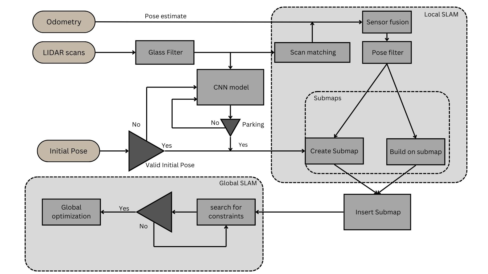
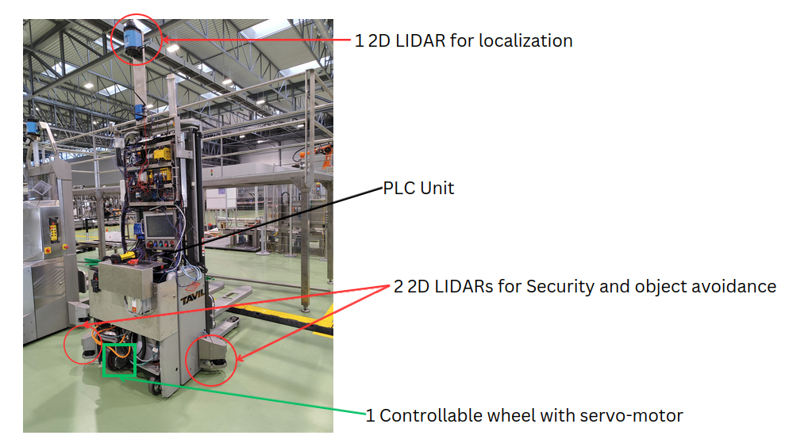
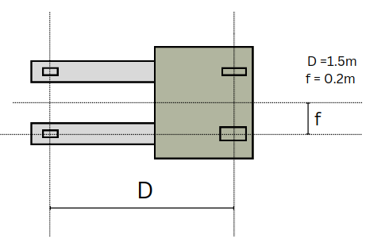
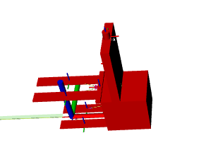
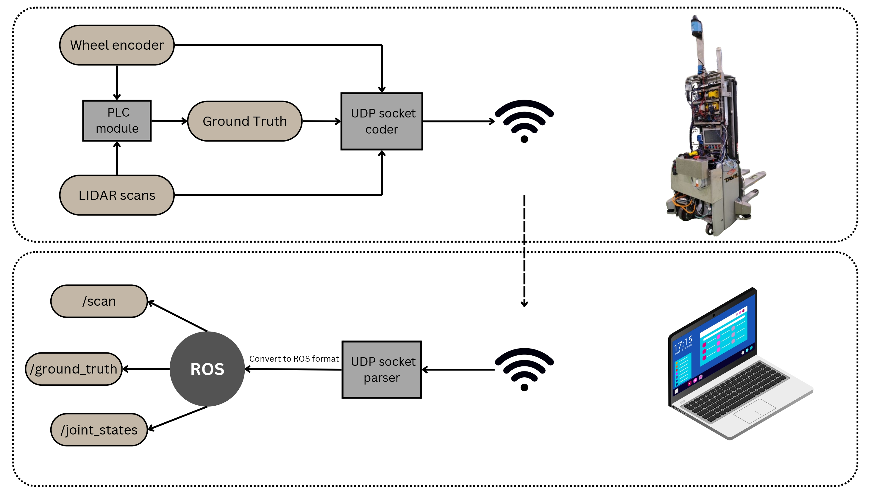
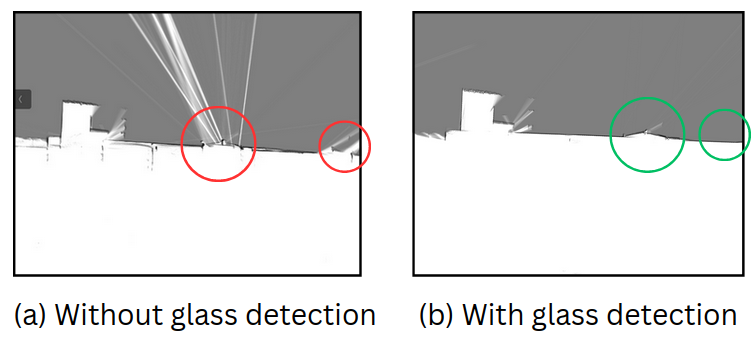
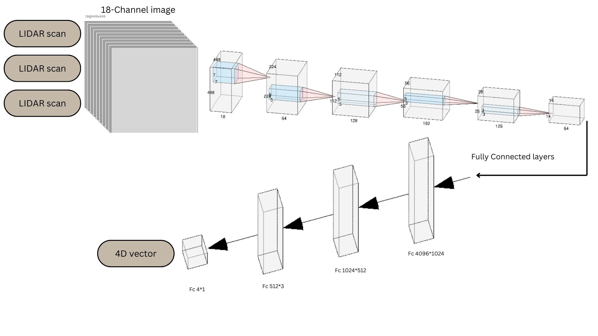
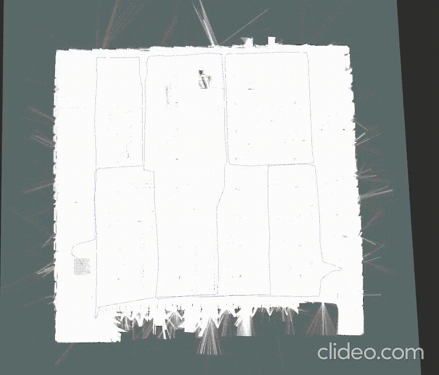
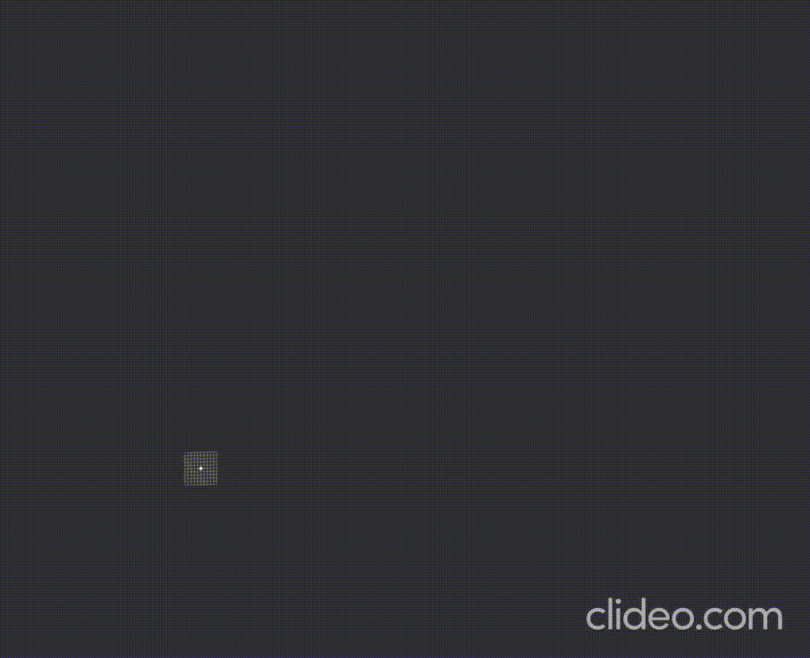

# Introduction
This repository is to be deployed on the Frankenstein AGV which is a prototype AGV robot developed by Tavil.
# Objective
The main objective of this project is to replace the PLC module with a ROS module that can perform the mapping and localization task. ROS will offer more flexibility and customization to the implemented system, allowing for the integration of a wide range of sensors and hardware components.
The PLC module output will be used as a ground truth to be compared to the implemented SLAM results for testing and evaluation purposes. 

# Task
The repository solves the mapping and localization challenge for an industrial AGV in a production environment. 
It includes:
* Frankenstein robot description (Gazebo model, geometry, etc...).
* Implementation of the cartographer SLAM including (Odometry computation, LIDAR data filtering).
* Implementation of a Glass detection algorithm.
* Solving the kidnapped robot problem using a deep learning approach.

## Created by
**Amine Dhemaied** -Intelligent field robotics master student

# Project architecture

<p align="center">
    
</p>


# Robot Description
**Frankenstein** is a prototype robot developed by TAVIL for testing purposes. The robot is considered a tricycle robot even though it technically has 4 wheels, and the reason is that the 4th wheel is free and it plays the role of a
caster, the front right wheel is the only controllable wheel and the 2 back wheels
are there for keeping balance and play a role in determining the rotation centre
point while rotating. The robot has 2 2D security LIDARs responsible mainly for
detecting the obstacles while moving. On the top of the AGV, there is another 2D
LIDAR responsible for mapping and localization and this will be used during the project work.

<p align="center">
    
</p>

## Robot Geometry:

<p align="center">
    
</p>

## Robot URDF

The robot model is created in urdf:

<p align="center">
    
</p>


## Integration with ROS

<p align="center">
    
</p>

# Results

## Mapping


## Glass detection

<p align="center">
    
</p>

## Pure localization


### CNN Model

<p align="center">
    
</p>

<table>
  <tr>
    <td>
      
      <p style="text-align:center;">Deep learning based localization</p>
    </td>
    <td>
      
      <p style="text-align:center;">Cartographer based localization</p>
    </td>
  </tr>
</table>


# How to run the project


## Cartographer installation

To install cartographer follow the instructions in the following 
[link](https://google-cartographer-ros.readthedocs.io/en/latest/compilation.html) 

Then follow this [link](https://github.com/cartographer-project/cartographer_ros/issues/1726)  to validate your data and rosbag.

To do mapping on Gazebo simulation run:
```
roslaunch frankenstein_gazebo frankenstein_gazebo.launch
```

To do pure localization on Gazebo simulation run:
```
roslaunch frankenstein_gazebo frankenstein_localization_gazebo.launch load_state_filename:=path/to/your/file.pbstream
```


To do online mapping on real robot run:
```
roslaunch frankenstein_reality frankenstein_reality.launch
```
To save the map before ending the online mapping, run the following commands:
```
rosservice call /finish_trajectory 0
rosservice call /write_state "{filename: '/path/to/your/file.pbstream'}"
rosrun cartographer_ros cartographer_pbstream_to_ros_map -map_filestem=/path/to/your/file.pbstream -pbstream_filename=/path/to/your/file.pbstream -resolution=0.05
```


To run offline mapping on real robot run:
```
cd path/to/cartographer_ws
source install_isolated/setup.bash
roslaunch cartographer_ros offline_frankenstein_reality.launch bag_filenames:=path/to/bagfile
```

To do pure localization on real robot run:
```
roslaunch frankenstein_reality frankenstein_localozation_reality.launch map_file:=/path/to/your/file.pbstream
```

To train the CNN model you run [this file](frankenstein_reality/src/train_model.py) (change the data path before)


To run localization using deep learning model (CHANGE THE PATH OF THE mode.pth in [this file](frankenstein_reality/src/initialPose_finder_glass.py) )

```
roslaunch frankenstein_reality frankenstein_localization_reality_bag_kidnapped.launch bag_file:=path/to/bagfile.bag map_file:=path/to/mapfile.pbstream
```